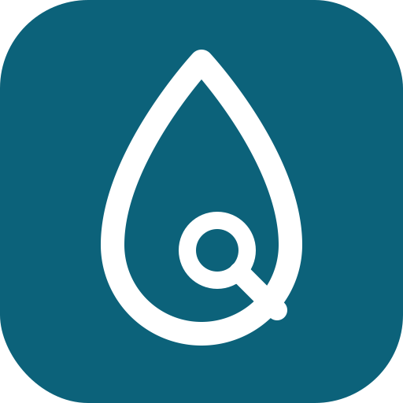

<p align="center">
  
</p>

<h1 align="center">AquaAI (AquaClue)</h1>

<p align="center">
  <strong>"Find the Missing Piece"</strong><br>
  <em>Adaptive, AI-Supported Stream Assessment with Human-in-the-Loop Integrity</em>
</p>

<p align="center">
  
  
  
</p>

> **"Don't ask everything. Ask what matters."** AquaAI is an adaptive intelligence layer built for urban stream monitoring in the **IEEE OneAquaHealth Global Hackathon 2026** (Primary: Track 3 AI-Supported Assessment; Secondary: Track 1 Citizen Science UX & Track 7 Digital Health Standards).

---

## Executive Summary

The **OneAquaHealth Citizen Science App** invites community volunteers to assess urban streams through an exhaustive, multi-field form (bank stabilization, impervious margins, water clarity, substrate composition, habitat structure). In practice:
- Volunteers skip questions, become overwhelmed, or answer with *"I'm not sure"*.
- Observations frequently contradict attached photos or spatial context.
- Environmental scientists cannot distinguish trustworthy submissions from noise, requiring costly manual triage.
- Lengthy forms deter repeat community participation, degrading long-term One Health surveillance.

**AquaAI (AquaClue)** solves this with an adaptive, human-in-the-loop intelligence layer. Instead of demanding a 20-field questionnaire upfront, it evaluates existing evidence, detects the highest-value information gap, and poses **one plain-language question at a time** until the observation reaches scientific readiness.

```
       [ Citizen Observation / Photos ]
                      │
                      ▼
        ┌───────────────────────────┐
        │  Evidence Reliability     │ ◄── Rule-based & fully explainable
        │  Scoring Engine           │     (Completeness + Consistency + Photo Agreement)
        └─────────────┬─────────────┘
                      │
         ┌────────────┴────────────┐
         ▼                         ▼
   Score < 80%                Score ≥ 80% (Ready)
┌───────────────────────┐   ┌──────────────────────────┐
│ Information-Gap       │   │ Publish Standardized     │
│ Targeted Questioning  │   │ HL7 FHIR R4 Observation  │
│ (Max gain per effort) │   │ (Ready / Verified Tier)  │
└───────────────────────┘   └──────────────────────────┘
```

---

## What It Does

AquaAI bridges the gap between everyday community stream observations and rigorous ecological research:

- **Adaptive, Step-by-Step Observation:** Replaces intimidating 20-question checklists with a friendly, guided flow. Users start with simple free-form notes, photos, and optional GPS coordinates.
- **Dynamic Evidence Completeness Ring:** Computes an explainable completeness score (ranging from 60% to 100%) that updates in real time based on geographic location, photo evidence, description detail, and answer clarity.
- **Targeted Information-Gap Questioning:** Automatically calculates which ecological indicator provides the highest scientific value and asks just that question with plain-language choices.
- **Photo-vs-Answer Conflict Detection:** Cross-checks human answers against computer-vision photo signals, detecting contradictions (e.g., reporting *"natural plants"* when photos reveal concrete embankment).
- **Human-in-the-Loop Conflict Protection:** When a conflict occurs, the system gently asks the volunteer to take a second look. If the volunteer re-confirms their finding, their voice is preserved and routed to **Expert review**—the AI never silently overrides human input.
- **Dual Citizen & Researcher Interfaces:**
  - **Citizen View:** Focused questionnaire, previous-answer editing, custom answer inputs (*"Others:"*), and instant printable PDF environmental reports.
  - **Researcher Dashboard:** Live triage queue sorted by urgency (`Expert review`, `Needs more info`, `Ready`), detailed audit trails, conflict inspection, and one-click verification.
- **Standardized Digital Health Publishing:** Exports every completed observation into an **HL7 FHIR R4 `Observation`** resource with custom extensions for evidence scores and review tiers.

---

## How It Works

AquaAI operates as an uncertainty-reduction loop composed of five coordinated stages:

```
[1. Ingest Evidence] ──► [2. Explainable Score] ──► [3. Detect Gap & Ask] ──► [4. Route & Triage] ──► [5. Export FHIR R4]
```

### 1. Ingestion & Multi-Signal Extraction
When a citizen submits an observation:
- Free-text descriptions are parsed by an allow-list validation layer for recognized environmental attributes (water clarity, bank materials, substrate).
- Attached photos are evaluated for visual signals (vegetation, concrete, algae, debris).
- GPS coordinates and observation metadata are registered.

### 2. Explainable Evidence Reliability Scoring
The core scoring engine in [`backend/engine.py`](backend/engine.py) computes evidence completeness without black-box neural networks. Every score traces directly to weighted indicators:
- **Corroborated answers** (photo agrees with citizen): `1.00`
- **Standard answers** (no contradiction): `0.85`
- **Re-confirmed answers under conflict**: `0.60` (routes to Expert Review)
- **Uncertain / Ambiguous answers**: `0.25`
- **Unresolved contradictions**: `0.20`
- **Missing indicators**: `0.00`

*Criteria adjustments apply based on GPS verification (+5%), photo corroboration (+7%), narrative detail (+3%), and consistency warning flags (-3% each).*

### 3. Information-Gap Detection (Greedy Gain-per-Effort)
The engine scans all remaining unobserved indicators and scores them using the expected gain per unit of volunteer effort:
$$\text{Priority} = \frac{\text{Weight}_f \times (1 - \text{CurrentValue}_f)}{\text{Effort}_f} + \text{ContradictionBonus}_f$$
The highest-ranking question is presented to the user. Trivial questions with negligible gain are automatically pruned, ending the survey as soon as the observation crosses the **80% Ready threshold**.

### 4. Human-in-the-Loop Routing & Triage
Every record is classified into an actionable review tier:
- **Ready ($\ge 80\%$):** High confidence, complete evidence, and consistent signals. Ready for immediate ingestion into environmental dashboards.
- **Usable – verify (70% – 79%):** Sufficient for general trends; optional quick scientist sign-off.
- **Needs more info ($< 70\%$):** Sparse details; prompts citizen for an additional photo or clarification.
- **Expert review (Any score with contradiction):** Hard conflict between photo signal and citizen selection. Preserved for limnologist manual inspection.

### 5. Standards-Compliant Interoperability
Outputs valid HL7 FHIR R4 JSON documents carrying answers as `component` slices and metadata as `extension` fields, bridging community science into institutional digital health systems.

---

## How to Use It

### Quick Tour: Citizen Experience

1. **Step 1: Observe (`/`)**
   - Enter what you notice at the stream (e.g., *"The water looked clear, with plants on both sides"*).
   - Click **Choose photos** to upload one or more stream pictures (with instant thumbnail preview and remove buttons).
   - Optionally toggle **Use my location** to attach GPS coordinates with visual status confirmation.
   - Click **Next: Review**.

2. **Step 2: Review Initial Clues**
   - AquaAI extracts recognized attributes and displays them as gentle suggestion chips.
   - Click **Confirm** to accept an extracted clue, or leave it for manual question answering.
   - Click **Next: Answer questions**.

3. **Step 3: Answer Targeted Questions**
   - AquaAI presents only the single most impactful question right above the answer choices.
   - Select an option, or choose **"Others:"** to type in a custom answer.
   - Made a mistake? Click **Previous** or jump directly via the step navigation bar (`1 Observe`, `2 Review`, `3 Answer`, `4 Done`) to revisit and edit earlier responses.
   - If a photo conflict is detected, AquaAI highlights the discrepancy and allows you to either adjust your answer or re-confirm what you personally witnessed.

4. **Step 4: Done & Export**
   - View your dynamic **Evidence Completeness Ring** (60% to 100%).
   - Expand **How AquaAI decided** to inspect the exact mathematical gain and runner-up questions.
   - Click **Download Summary Report** to generate a clean, printable PDF report containing observation details, review tiers, and complete audit history.

---

### Quick Tour: Researcher & City Manager Dashboard

1. **Accessing the Dashboard:**
   - Click the **Researcher · demo access** tab in the top navigation bar.
2. **Reviewing the Triage Queue:**
   - View all incoming observations sorted into categories:
     - **Expert review:** Flagged contradictions awaiting limnologist adjudication.
     - **Needs more info:** Observations requiring additional volunteer follow-up.
     - **Ready / Verified:** High-reliability submissions ready for environmental analysis.
3. **Auditing & Adjudication:**
   - Click any queue item to open its comprehensive dossier: view citizen statements, photo evidence, spatial coordinates, and full audit logs.
   - Click **Mark verified** to approve the record, or **Request more info** to flag it for field re-survey.
4. **Exporting FHIR R4 Data:**
   - Inspect the live **HL7 FHIR R4 Observation JSON** directly within the dashboard for seamless export into environmental GIS and public health databases.

---

## Core Pillars & Track Alignment

### Track 3: AI-Supported Assessment (Primary)
1. **Validation Checks (Photo-vs-Answer Consistency):** Detects contradictions between user selections and photo-derived signals (e.g., reporting *"natural vegetated banks"* while photos indicate concrete channel walls).
2. **Explainable AI (XAI):** Every single percentage point traces directly to a specific field weight, consistency cross-check, or verified detail. No black-box opacity.
3. **Human-in-the-Loop (HITL) Workflow:** Contradictions are routed to human expert review—**never silently altered or overridden by AI**. If the citizen re-confirms their finding against the AI's suggestion, the citizen's word is preserved and prioritized for specialist inspection.

### Track 1: Citizen Science UX (Secondary)
- **Zero Questionnaire Fatigue:** Transforms a tedious multi-page checklist into a guided 3-minute conversation.
- **Dynamic Gain-per-Question:** Prioritizes questions offering the highest information gain per unit of cognitive effort.
- **Supportive Feedback:** Inline guidance explains *why* the question is asked and how it advances stream assessment.

### Track 7: Digital Health Standards & Interoperability (Secondary)
- Emits standard **HL7 FHIR R4 `Observation`** payloads.
- Includes citizen answers as structured `component` elements, along with custom extensions for the **reliability score** and **review tier**.
- Aligns with the OneAquaHealth FHIR Implementation Guide to unify citizen science reporting with sensor arrays and laboratory assays.

---

## How the Scoring Engine Works

The reliability score measures **how well-supported and consistent an observation is**—it is explicitly **not** a probability of truth or an ecological health diagnosis.

### Field State Weights

Each ecological field carries an assigned importance weight. A field's contribution is computed based on its evidence state:

| Field State | Weight Factor | Description |
| :--- | :---: | :--- |
| **Answered & photo agrees** | `1.00` | Citizen answer cross-checked and corroborated by photographic signals. |
| **Answered, unverified** | `0.85` | Citizen answer recorded without contradictory evidence. |
| **Contradiction re-confirmed** | `0.60` | Citizen reviewed the photo contradiction and maintained their answer; routed to **Expert review**. |
| **"I'm not sure" / Ambiguous** | `0.25` | Citizen indicated uncertainty or low visibility. |
| **Answer contradicts photo** | `0.20` | Unresolved conflict between citizen answer and image evidence; lowers score and triggers triage. |
| **Missing** | `0.00` | Unanswered field. |

### Scoring & Question Selection Formulas

$$\text{Evidence Reliability Score} = \left( \frac{\sum_{i} \text{Weight}_i \times \text{StateValue}_i}{\sum_{i} \text{Weight}_i} \right) \times 100$$

The engine selects the next question by identifying the unanswered field that maximizes **expected information gain per unit of volunteer effort**:

$$\text{Next Question} = \arg\max_{f \in \text{Unanswered}} \left( \frac{\text{Weight}_f \times (1 - \text{CurrentValue}_f)}{\text{Effort}_f} + \text{ContradictionBonus}_f \right)$$

*Questions falling below a minimum gain threshold are omitted entirely, ensuring volunteers are never over-questioned.*

---

## Empirical Prototype Results

Benchmarked using the automated test suite and scripted scenario evaluations in `eval.py`:

* **Contradiction Resolution in a Single Step:** An observation with an unresolved conflict between *"natural banks"* and photo evidence of concrete walls started at **77.4% (Expert Review)**. After a single targeted prompt asking the citizen to re-check the bank substrate, the score rose to **89.6% (Ready)**.
* **Rapid Convergence without Full Forms:** Starting from a sparse initial note at **37.7%**, the engine selected questions in descending value order:
  $$\mathbf{37.7\%} \;\longrightarrow\; 46.4\% \;\longrightarrow\; 55.0\% \;\longrightarrow\; 62.2\% \;\longrightarrow\; 68.0\% \;\longrightarrow\; 75.2\% \;\longrightarrow\; \mathbf{82.4\%} \;\longrightarrow\; \mathbf{89.6\%}$$
  The assessment crossed the scientific readiness threshold ($\ge 80\%$) in just **6 questions**, saving up to 70% of the input effort required by conventional survey forms.
* **Human-in-the-Loop Integrity:** When a user insisted on an answer contradicting the computer vision signal, the system recorded the citizen's confirmation, maintained the score at **83.5%**, and locked the status to **Expert review** for scientist verification.

---

## System Architecture

```text
┌────────────────────────────────────────────────────────┐
│                   Frontend (Web UI)                    │
│   Vanilla Modern HTML5 / CSS Glassmorphism / Vanilla JS │
│   - Multi-photo upload with instant thumbnail preview  │
│   - Live question flow with previous answer navigation │
│   - Dynamic Evidence Ring (60% - 100% variance)        │
│   - Researcher review queue and one-click PDF reports  │
└───────────────────────────┬────────────────────────────┘
                            │ HTTP / JSON API
                            ▼
┌────────────────────────────────────────────────────────┐
│               FastAPI Application Layer                │
│                 (backend/main.py)                      │
│   Endpoints: /api/observations, /api/fields,           │
│   /api/review-queue, /api/observations/{id}/fhir       │
└─────────────┬────────────────────────────┬─────────────┘
              ▼                            ▼
┌───────────────────────────┐ ┌──────────────────────────┐
│   Scoring & Gap Engine    │ │   Validation & Conflict  │
│    (backend/engine.py)    │ │ (backend/validation.py)  │
│ - Explainable weights     │ │ - Photo-vs-answer rules  │
│ - Gain-per-effort triage  │ │ - Suspicious input flags │
│ - Evidence completeness   │ │ - Deterministic checks   │
└─────────────┬─────────────┘ └──────────────────────────┘
              ▼
┌────────────────────────────────────────────────────────┐
│             HL7 FHIR R4 Interoperability               │
│ Standard Observation resource with reliability scores, │
│ component observations, and review tier extensions.    │
└────────────────────────────────────────────────────────┘
```

---

## Quickstart & Installation

### Requirements
- **Python 3.10+**
- Modern Web Browser (Chrome, Edge, Firefox, Safari)

### 1. Clone & Install Dependencies
```bash
git clone https://github.com/Eusha-Kayenat/AquaAI.git
cd AquaAI
python -m pip install -r requirements.txt
```

### 2. Start the Application
```bash
# Using the launcher script:
python run.py

# Or directly with uvicorn:
python -m uvicorn backend.main:app --host 127.0.0.1 --port 8000
```
Open your browser to: **`http://127.0.0.1:8000`**

---

## Verification & Automated Tests

AquaAI includes a full unit test suite and synthetic evaluation pipeline:

```bash
# Run all unit tests (15 test cases):
python -m unittest discover -s tests -v

# Run synthetic evaluation benchmark:
python eval.py
```

### Expected Evaluation Metrics:
```text
Question-selection agreement: 60.0% (12/20)
Conflict-detection precision: 25.0% (2/8)
Conflict-detection recall: 50.0% (2/4)
Vague-word inputs left null: 100.0% (20/20)
```

---

## Digital Health Standards (HL7 FHIR R4)

AquaAI transforms citizen observations into standard FHIR R4 JSON payloads ready for public health registries and environmental monitoring sandboxes:

```json
{
  "resourceType": "Observation",
  "id": "obs-6410e1f9e9",
  "status": "preliminary",
  "code": {
    "coding": [{
      "system": "http://oneaquahealth.eu/fhir/cs/stream-observation",
      "code": "stream-habitat-assessment",
      "display": "Stream Habitat and Ecological Assessment"
    }]
  },
  "extension": [
    {
      "url": "http://oneaquahealth.eu/fhir/StructureDefinition/evidence-reliability-score",
      "valueDecimal": 89.6
    },
    {
      "url": "http://oneaquahealth.eu/fhir/StructureDefinition/review-tier",
      "valueString": "Ready"
    }
  ],
  "component": [
    {
      "code": { "text": "Water appearance" },
      "valueString": "Clear"
    },
    {
      "code": { "text": "Left bank material" },
      "valueString": "Natural vegetation"
    }
  ]
}
```

---

## Responsible AI & Honest Limitations

1. **Evidence Quality $\neq$ Ecological Truth:** The reliability score gauges information completeness, clarity, and consistency. It does not measure ecological water purity or diagnose biological contamination.
2. **AI Never Overrides the Citizen:** Machine vision outputs are strictly presented as suggestions (`"AI suggestion — please confirm"`). In any contradiction, the human volunteer or researcher review retains final authority.
3. **Calibrated Field Data Needed:** Current weights and thresholds reflect expert-designed defaults. The immediate next milestone is empirical calibration against real citizen-vs-limnologist datasets from OneAquaHealth pilot basins.
4. **Deterministic Foundation:** Core scoring and routing operate entirely without generative hallucinations. Optional LLM integrations are restricted to plain-language phrasing and strictly forbidden from modifying numerical scores.

---

## Project Repository Structure

```text
AquaAI/
├── backend/
│   ├── main.py          # FastAPI application routes & static file server
│   ├── engine.py        # Core scoring engine, weights, gain math & questions
│   ├── service.py       # Observation store, seed data & orchestration
│   ├── validation.py    # Conflict rules & data integrity checks
│   ├── ai_provider.py   # Deterministic mock provider & LLM interfaces
│   └── prompts/         # Versioned, auditable system prompts
├── frontend/
│   ├── index.html       # Single-page interface (Citizen + Researcher views)
│   ├── demo.js          # Client-side state transitions & demo controls
│   └── favicon.png      # Official AquaAI brand icon
├── tests/
│   ├── test_api.py      # FastAPI HTTP integration tests
│   ├── test_core.py     # Pure engine and scoring unit tests
│   └── eval_set.json    # Synthetic benchmark scenarios
├── eval.py              # Synthetic evaluation script
├── run.py               # Standalone application entrypoint
└── requirements.txt     # Python dependencies
```

---

## License & Acknowledgements

Developed for the **IEEE OneAquaHealth Global Hackathon 2026**.  
Built in compliance with the **OneAquaHealth One Health Framework** for urban aquatic ecosystem preservation.
